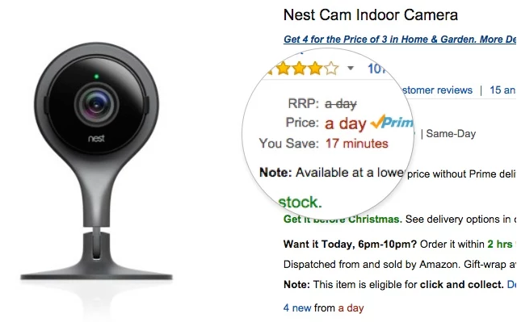

# Time is Money

A Chrome plugin that converts money to time.

## Using the plugin

Install it from the Chrome web store:
https://chrome.google.com/webstore/detail/time-is-money/djgfofcgmhmmamdbjbcefbmclhblcpkn

## Running the tests

- Start a server in the project directory: `python -m SimpleHTTPServer`
- Visit http://localhost:8000/test

## To do

- Remove unhelpfully small units (e.g. "4 minutes", not "4 minutes, 3 seconds")
- Add 'advanced' fields: tax, days a week, hours a day
- Change the numbers without a refresh when you click on/off
- Add ability to compare to another unit (e.g. how many coffees is that)
- Example pages to look at
- Compare your wage against...
